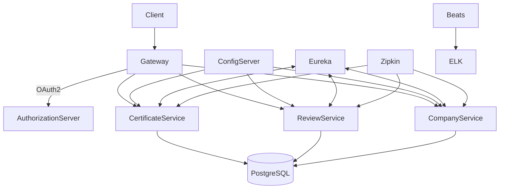

# Certification Review Platform


A **microservices-based platform** for managing and reviewing professional certifications (e.g., IT certifications) by companies.  
The project leverages **Spring Cloud** for service orchestration, **OAuth2** for security, **Kubernetes** for deployment, and modern monitoring/logging stacks for observability.

---

## 🚀 Features

- **API Gateway** – Spring Cloud Gateway for request routing and filtering  
- **Authentication & Authorization** – OAuth2 + JWT with dedicated Auth Server  
- **Service Discovery** – Eureka for service registration and lookup  
- **Configuration Management** – Centralized Spring Cloud Config Server  
- **Databases** – PostgreSQL for persistence  
- **REST APIs** – Certification and review services with REST controllers  
- **Logging** –  
  - **Log4j2** for structured JSON logs  
  - **Zalando Logbook** for HTTP request/response logging  
  - All logs written to **stdout/stderr** so they can be collected by ELK via Filebeat  
- **Testing** – WireMock for mocking dependencies, JUnit + Spring Boot Test  
- **Tracing** – Zipkin for distributed tracing  
- **Monitoring** – ELK (Elasticsearch, Logstash, Kibana) with Filebeat & Metricbeat  
- **Containerization** – Docker for local builds, Kubernetes for orchestration  

---

## 🏗️ Architecture



---

## 🧾 Logging & Observability

- **Log4j2**: structured logs in JSON format, output to console  
- **Zalando Logbook**: captures and logs HTTP requests/responses  
- **Filebeat**: collects container logs (`stdout/stderr`) and ships them to Elasticsearch  
- **Metricbeat**: exports service and system metrics  
- **Kibana**: dashboard for searching logs and visualizing metrics  
- **Zipkin**: end-to-end tracing across microservices  

---

## 🐳 Local Deployment with Docker

Build and run locally with Docker Compose:  

```bash
docker-compose build
docker-compose up
```

Services will start with logging to console. Filebeat will ship logs into Elasticsearch, and Kibana will expose dashboards.  

---

## 📂 Repository Structure

```
.
├── gateway/                  # Spring Cloud Gateway (API routing & filtering)
├── authorization-server/     # OAuth2 Authorization Server (JWT-based auth)
├── certificate-service/      # Certification management microservice
├── company-service/          # Company management microservice
├── review-service/           # Certification review microservice
├── config-server/            # Spring Cloud Config Server
├── eureka-server/            # Service discovery (Eureka)
│
├── config-repo/              # Local configuration files for services
├── elk-stack-docker-compose/ # ELK stack (Elasticsearch, Logstash, Kibana, Beats)
├── init-db/                  # Database initialization scripts (Docker)
├── test/                     # WireMock setup for testing with fake responses
├── utils/                    # Utility scripts/helpers for the project
│
├── docker-compose.yml        # Local Docker setup (services + ELK)
└── README.md                 # Project documentation

```

## 📈 Roadmap

- [ ] Add Kubernetes **Horizontal Pod Autoscaler (HPA)**  
- [ ] Implement **CI/CD pipeline** (GitHub Actions / GitLab CI)  
- [ ] Introduce **Kubernetes secrets manager** for credentials  
- [ ] Extend review workflows with approval chains  
